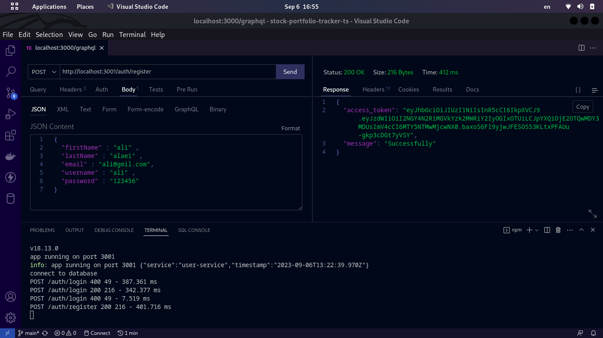
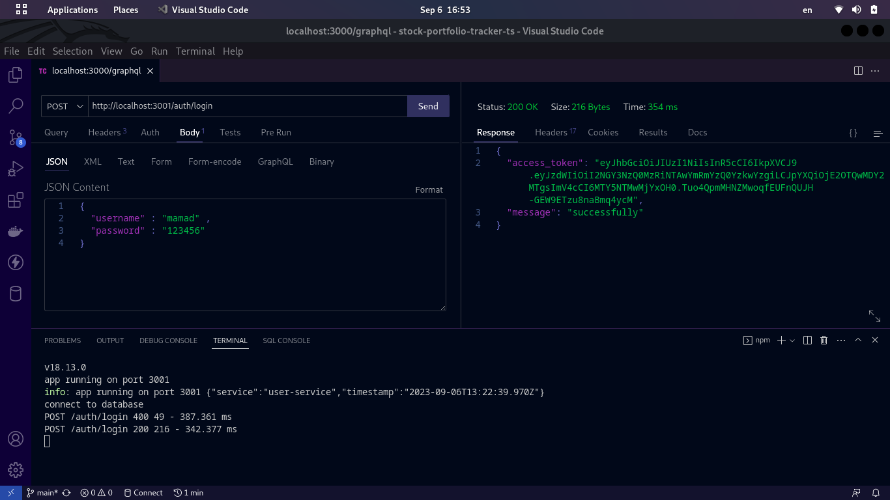
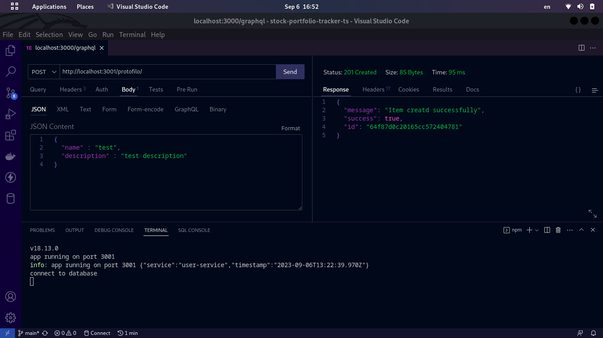
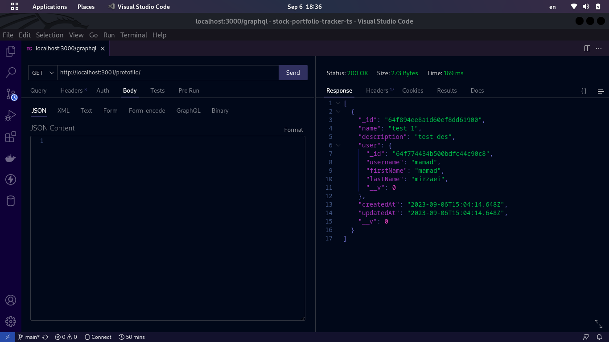
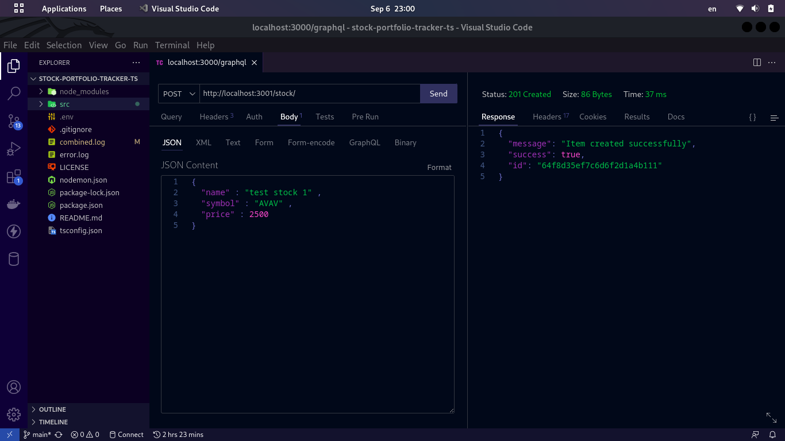
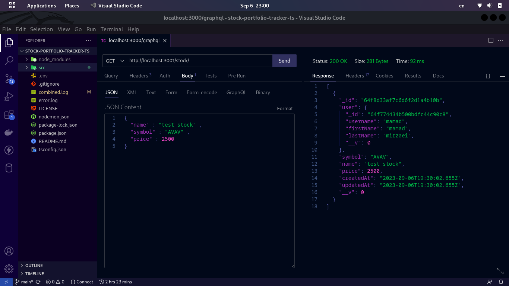
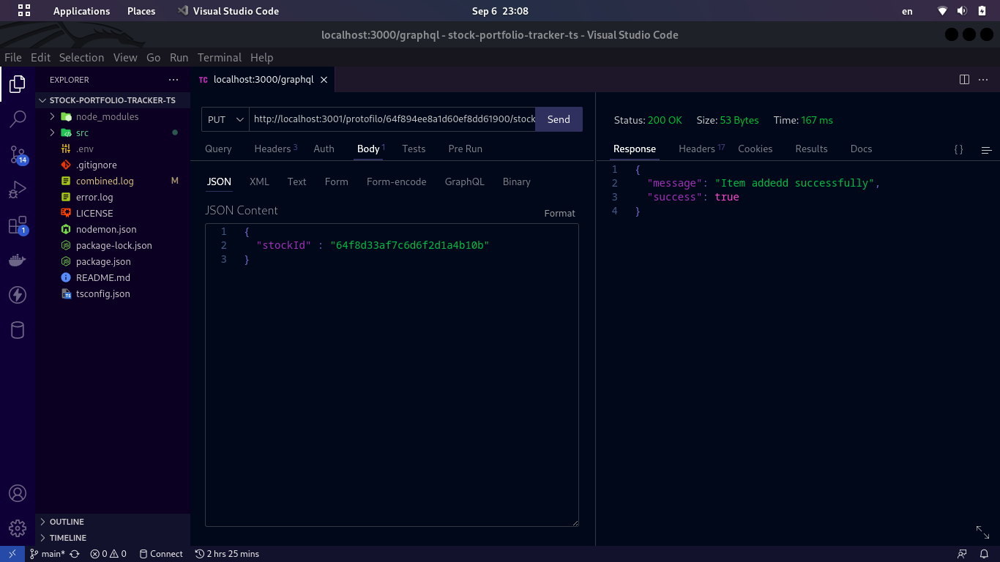

# Stock Portfolio Tracker TS

This repository contains a basic implementation of a stock portfolio tracker backend using Express.js and TypeScript. It includes features for user authentication, adding and removing stocks from the portfolio, real-time stock data retrieval using a financial data API, and tracking portfolio performance over time.

The Stock Portfolio Tracker is a web-based application that allows users to manage their stock portfolios. It provides real-time stock data, portfolio analysis, and performance tracking.

## Features

- **User Authentication:** Secure user registration and login system.
- **Stock Portfolio Management:** Add, remove, and track stocks in your portfolio.
- **Real-Time Stock Data:** Fetch real-time stock prices and information.
- **Portfolio Diversification:** Analyze and optimize your portfolio for better diversification.
- **Historical Performance:** View historical performance charts of your portfolio.
- **User-Friendly API:** Well-documented API for easy integration into other applications.


## Demo 

### Register : 




### Login : 




### Create protofilo : 




### Show protofilo :




### Create stock : 


 


### Find stock : 




### Add stock to protofilo 




## Getting Started

- Prerequisites
- Node.js and npm installed on your system.

## API Endpoints

| Endpoint                     | Method | Description                                | Example Request                                | Example Response                                |
| ---------------------------- | ------ | ------------------------------------------ | ----------------------------------------------- | ----------------------------------------------- |
| `/api/auth/register`         | POST   | Register a new user account.               | `{ "username": "john_doe", "email": "john@example.com", "password": "securePassword123" }` | `{"message": "User registered successfully"}` |
| `/api/auth/login`            | POST   | Log in with an existing user account.      | `{ "email": "john@example.com", "password": "securePassword123" }` | `{"token": "eyJhbGciOiJIUzI1NiIsInR5cCI6IkpXVCJ9...}` |
| `/api/portfolio`             | GET    | Get the user's portfolio with stock holdings and performance data. | N/A | `{"portfolio": {...}, "stocks": [...], "performance": {...}}` |
| `/api/portfolio/add`         | POST   | Add a stock to the user's portfolio.       | `{ "symbol": "AAPL", "quantity": 10 }`       | `{"message": "Stock added to the portfolio"}` |
| `/api/portfolio/remove`      | POST   | Remove a stock from the user's portfolio.  | `{ "symbol": "AAPL" }`                        | `{"message": "Stock removed from the portfolio"}` |
| `/api/stocks/:symbol`        | GET    | Get real-time stock data for a specific stock symbol. | N/A | `{"symbol": "AAPL", "name": "Apple Inc.", "price": 150.25, "lastUpdated": "2023-09-01T12:00:00Z"}` |
| `/api/stocks/search?query=`  | GET    | Search for stocks by symbol or name.       | `/api/stocks/search?query=AAPL`              | `{"results": [...], "totalResults": 5}` |
| `/api/portfolio/analyze`     | GET    | Analyze the diversification of the user's portfolio. | N/A | `{"diversificationScore": 85}` |
| `/api/portfolio/history`     | GET    | Get historical performance data for the user's portfolio. | N/A | `{"history": [...], "startDate": "2023-01-01", "endDate": "2023-09-01"}` |
| `/api/user/profile`          | GET    | Get the user's profile information.        | N/A | `{"username": "john_doe", "email": "john@example.com", "firstName": "John", "lastName": "Doe"}` |
| `/api/user/profile`          | PUT    | Update the user's profile information.     | `{ "firstName": "John", "lastName": "Doe" }` | `{"message": "Profile updated successfully"}` |
| `/api/user/settings`         | GET    | Get user account settings.                 | N/A | `{"currency": "USD", "theme": "dark"}` |
| `/api/user/settings`         | PUT    | Update user account settings.              | `{ "notification": true, "theme": "dark" }`  | `{"message": "Settings updated successfully"}` |
| `/api/portfolio/buy`         | POST   | Buy stocks and add them to the portfolio.  | `{ "symbol": "GOOG", "quantity": 5 }`        | `{"message": "Stocks bought and added to the portfolio"}` |
| `/api/portfolio/sell`        | POST   | Sell stocks from the portfolio.            | `{ "symbol": "AAPL", "quantity": 3 }`        | `{"message": "Stocks sold from the portfolio"}` |
| `/api/portfolio/transactions` | GET    | Get a list of all portfolio transactions.  | N/A | `{"transactions": [...], "totalTransactions": 10}` |
| `/api/portfolio/transactions/:id` | GET | Get details of a specific transaction.     | N/A | `{"transaction": {...}}` |
| `/api/news`                  | GET    | Fetch the latest financial news.            | N/A | `{"news": [...], "totalNews": 5}` |
| `/api/notifications`         | GET    | Get user notifications.                    | N/A | `{"notifications": [...], "totalNotifications": 5}` |
| `/api/notifications`         | POST   | Create a new notification.                 | `{ "message": "New stock added." }` | `{"message": "Notification created successfully"}` |
| `/api/notifications/:id`     | DELETE | Delete a specific notification.           | N/A | `{"message": "Notification deleted successfully"}` |
| `/api/watchlist`             | GET    | Get the user's stock watchlist.            | N/A | `{"watchlist": [...], "totalStocks": 5}` |
| `/api/watchlist/add`         | POST   | Add a stock to the user's watchlist.       | `{ "symbol": "TSLA" }` | `{"message": "Stock added to the watchlist"}` |
| `/api/watchlist/remove`      | POST   | Remove a stock from the watchlist.         | `{ "symbol": "TSLA" }` | `{"message": "Stock removed from the watchlist"}` |
| `/api/settings`              | GET    | Get application settings.                  | N/A | `{"currency": "USD", "theme": "light"}` |
| `/api/settings`              | PUT    | Update application settings.               | `{ "currency": "USD", "theme": "light" }`   | `{"message": "Settings updated successfully"}` |
| `/api/portfolio/stats`       | GET    | Get overall portfolio statistics.          | N/A | `{"statistics": {...}}` |
| `/api/portfolio/dividends`   | GET    | Get dividend income for the portfolio.     | N/A | `{"dividendIncome": 2500.00}` |
| `/api/portfolio/roi`         | GET    | Get return on investment for the portfolio.| N/A | `{"roi": 10.25}` |
| `/api/stocks/recommendations` | GET   | Get stock recommendations based on user preferences. | N/A | `{"recommendations": [...], "totalRecommendations": 5}` |
| `/api/stocks/history/:symbol` | GET   | Get historical stock data for a specific symbol. | N/A | `{"history": [...], "symbol": "AAPL"}` |
| `/api/stocks/news/:symbol`   | GET   | Get news related to a specific stock.      | N/A | `{"news": [...], "symbol": "AAPL"}` |
| `/api/portfolio/alerts`      | GET    | Get portfolio alerts and notifications.   | N/A | `{"alerts": [...], "totalAlerts": 5}` |
| `/api/portfolio/alerts`      | POST   | Create a new portfolio alert.             | `{ "symbol": "AAPL", "targetPrice": 150 }`   | `{"message": "Alert created successfully"}` |
| `/api/portfolio/alerts/:id`  | PUT    | Update a portfolio alert.                 | `{ "targetPrice": 160 }`   | `{"message": "Alert updated successfully"}` |
| `/api/portfolio/alerts/:id`  | DELETE | Delete a portfolio alert.                 | N/A | `{"message": "Alert deleted successfully"}` |
| `/api/stocks/compare`        | POST   | Compare multiple stocks' performance.     | `{ "symbols": ["AAPL", "GOOG", "TSLA"] }`    | `{"comparison": {...}}` |
| `/api/stocks/symbols`        | GET    | Get a list of available stock symbols.    | N/A | `{"symbols": ["AAPL", "GOOG", "TSLA"]}` |
| `/api/portfolio/strategies`  | GET    | Get recommended investment strategies based on user preferences. | N/A | `{"strategies": [...], "totalStrategies": 5}` |
| `/api/portfolio/strategies/:id` | GET  | Get details of a specific investment strategy. | N/A | `{"strategy": {...}}` |
| `/api/portfolio/strategies`  | POST   | Create a custom investment strategy.       | `{ "name": "My Strategy", "description": "A custom investment strategy", "assets": ["AAPL", "GOOG"] }` | `{"message": "Strategy created successfully"}` |
| `/api/portfolio/strategies/:id` | PUT  | Update a custom investment strategy.       | `{ "name": "Updated Strategy", "description": "An updated custom investment strategy" }` | `{"message": "Strategy updated successfully"}` |
| `/api/portfolio/strategies/:id` | DELETE | Delete a custom investment strategy.     | N/A | `{"message": "Strategy deleted successfully"}` |
| `/api/transactions`           | GET    | Get a list of all user transactions (buy/sell orders). | N/A | `{"transactions": [...], "totalTransactions": 10}` |
| `/api/transactions/:id`       | GET    | Get details of a specific transaction.     | N/A | `{"transaction": {...}}` |
| `/api/transactions/buy`       | POST   | Create a buy order for a stock.           | `{ "symbol": "AAPL", "quantity": 5 }`        | `{"message": "Buy order created successfully"}` |
| `/api/transactions/sell`      | POST   | Create a sell order for a stock.          | `{ "symbol": "AAPL", "quantity": 3 }`        | `{"message": "Sell order created successfully"}` |
| `/api/transactions/:id`       | DELETE | Cancel a pending transaction.             | N/A | `{"message": "Transaction canceled successfully"}` |
| `/api/alerts`                  | GET    | Get user-specific alerts and notifications. | N/A | `{"alerts": [...], "totalAlerts": 5}` |
| `/api/alerts/:id`              | GET    | Get details of a specific alert.           | N/A | `{"alert": {...}}` |
| `/api/alerts`                  | POST   | Create a new alert or notification.       | `{ "type": "price", "symbol": "AAPL", "targetPrice": 150 }` | `{"message": "Alert created successfully"}` |
| `/api/alerts/:id`              | PUT    | Update an existing alert.                 | `{ "type": "price", "targetPrice": 160 }`   | `{"message": "Alert updated successfully"}` |
| `/api/alerts/:id`              | DELETE | Delete an alert or notification.          | N/A | `{"message": "Alert deleted successfully"}` |
| `/api/transactions/history`    | GET    | Get historical transaction data.           | N/A | `{"history": [...], "totalTransactions": 10}` |
| `/api/transactions/history/:id` | GET  | Get historical data for a specific transaction. | N/A | `{"transaction": {...}}` |
| `/api/user/logout`             | POST   | Log the user out and invalidate the session. | N/A | `{"message": "User logged out successfully"}` |
| `/api/user/forgot-password`    | POST   | Request a password reset email.            | `{ "email": "john@example.com" }` | `{"message": "Password reset email sent successfully"}` |
| `/api/user/reset-password`     | POST   | Reset the user's password with a valid reset token. | `{ "token": "valid_token", "password": "newPassword123" }` | `{"message": "Password reset successfully"}` |
| `/api/user/change-password`    | PUT    | Change the user's password.                | `{ "currentPassword": "oldPassword123", "newPassword": "newPassword123" }` | `{"message": "Password changed successfully"}` |

## Database Schema: StockPortfolio

### User Collection

- `user_id` (ObjectId): Unique identifier for each user (auto-generated by MongoDB).
- `username` (String): User's chosen username.
- `email` (String): User's email address.
- `password` (String): Hashed password for authentication.
- `firstName` (String): User's first name.
- `lastName` (String): User's last name.
- `createdAt` (Date): Timestamp for user registration.
- `updatedAt` (Date): Timestamp for user profile updates.

### Portfolio Collection

- `portfolio_id` (ObjectId): Unique identifier for each portfolio (auto-generated by MongoDB).
- `user_id` (ObjectId): Reference to the user who owns the portfolio.
- `name` (String): User-defined name for the portfolio.
- `description` (String): Description of the portfolio.
- `createdAt` (Date): Timestamp for portfolio creation.
- `updatedAt` (Date): Timestamp for portfolio updates.

### Stock Collection

- `stock_id` (ObjectId): Unique identifier for each stock (auto-generated by MongoDB).
- `symbol` (String): Stock symbol, e.g., AAPL for Apple Inc.
- `name` (String): Full name of the stock.
- `price` (Number): Current stock price.
- `lastUpdated` (Date): Timestamp for the last update of stock data.

### PortfolioStock Collection (Many-to-Many Relationship)

- `portfolioStock_id` (ObjectId): Unique identifier for each portfolio-stock relationship (auto-generated by MongoDB).
- `portfolio_id` (ObjectId): Reference to the portfolio.
- `stock_id` (ObjectId): Reference to the stock.
- `quantity` (Number): Number of shares of the stock in the portfolio.
- `purchasePrice` (Number): Price at which the stock was purchased.
- `purchaseDate` (Date): Date of purchase.

### Transaction Collection

- `transaction_id` (ObjectId): Unique identifier for each transaction (auto-generated by MongoDB).
- `user_id` (ObjectId): Reference to the user initiating the transaction.
- `stock_id` (ObjectId): Reference to the stock involved in the transaction.
- `type` (String): Transaction type (e.g., "buy" or "sell").
- `quantity` (Number): Number of shares bought or sold.
- `price` (Number): Price per share at the time of the transaction.
- `transactionDate` (Date): Timestamp for the transaction.

### Notification Collection

- `notification_id` (ObjectId): Unique identifier for each notification (auto-generated by MongoDB).
- `user_id` (ObjectId): Reference to the user receiving the notification.
- `type` (String): Notification type (e.g., "priceAlert" or "news").
- `message` (String): Content of the notification.
- `createdAt` (Date): Timestamp for notification creation.

### Watchlist Collection

- `watchlist_id` (ObjectId): Unique identifier for each user's watchlist (auto-generated by MongoDB).
- `user_id` (ObjectId): Reference to the user who owns the watchlist.
- `stocks` (Array of ObjectId): References to stocks added to the watchlist.
- `createdAt` (Date): Timestamp for watchlist creation.
- `updatedAt` (Date): Timestamp for watchlist updates.

### Alert Collection

- `alert_id` (ObjectId): Unique identifier for each user's custom alerts (auto-generated by MongoDB).
- `user_id` (ObjectId): Reference to the user who set up the alert.
- `type` (String): Alert type (e.g., "price" or "news").
- `symbol` (String): Symbol of the stock the alert is associated with.
- `targetPrice` (Number): The price at which the alert should trigger (for price alerts).
- `createdAt` (Date): Timestamp for alert creation.

### StockRecommendation Collection

- `recommendation_id` (ObjectId): Unique identifier for each stock recommendation (auto-generated by MongoDB).
- `user_id` (ObjectId): Reference to the user receiving the recommendation.
- `symbol` (String): Symbol of the recommended stock.
- `strategy` (String): Name of the investment strategy that led to the recommendation.
- `createdAt` (Date): Timestamp for recommendation creation.

### Strategy Collection

- `strategy_id` (ObjectId): Unique identifier for each investment strategy (auto-generated by MongoDB).
- `user_id` (ObjectId): Reference to the user who created the strategy.
- `name` (String): Name of the investment strategy.
- `description` (String): Description of the strategy.
- `assets` (Array of String): List of stock symbols associated with the strategy.
- `createdAt` (Date): Timestamp for strategy creation.
- `updatedAt` (Date): Timestamp for strategy updates.

### AssetRecommendation Collection

- `assetRecommendation_id` (ObjectId): Unique identifier for each asset recommendation (auto-generated by MongoDB).
- `strategy_id` (ObjectId): Reference to the investment strategy that led to the recommendation.
- `symbol` (String): Symbol of the recommended asset (stock).
- `recommendationType` (String): Type of recommendation (e.g., "buy" or "sell").
- `targetPrice` (Number): The target price for the asset.
- `createdAt` (Date): Timestamp for asset recommendation creation.

### Settings Collection

- `settings_id` (ObjectId): Unique identifier for each user's application settings (auto-generated by MongoDB).
- `user_id` (ObjectId): Reference to the user who owns the settings.
- `currency` (String): User's preferred currency for financial data (e.g., "USD" or "EUR").
- `theme` (String): User's preferred application theme (e.g., "light" or "dark").
- `createdAt` (Date): Timestamp for settings creation.
- `updatedAt` (Date): Timestamp for settings updates.

### TransactionHistory Collection

- `transactionHistory_id` (ObjectId): Unique identifier for each transaction history entry (auto-generated by MongoDB).
- `user_id` (ObjectId): Reference to the user associated with the transaction history.
- `type` (String): Type of transaction (e.g., "buy" or "sell").
- `symbol` (String): Symbol of the stock involved in the transaction.
- `quantity` (Number): Number of shares bought or sold.
- `price` (Number): Price per share at the time of the transaction.
- `transactionDate` (Date): Timestamp for the transaction.
- `notes` (String): Additional notes or comments for the transaction.

### DividendCollection

- `dividend_id` (ObjectId): Unique identifier for each dividend record (auto-generated by MongoDB).
- `user_id` (ObjectId): Reference to the user associated with the dividend record.
- `stock_id` (ObjectId): Reference to the stock that paid the dividend.
- `amount` (Number): Dividend amount received.
- `paymentDate` (Date): Date when the dividend was paid.
- `recordDate` (Date): Record date for dividend eligibility.

### ReturnOnInvestmentCollection

- `roi_id` (ObjectId): Unique identifier for each return on investment (ROI) record (auto-generated by MongoDB).
- `user_id` (ObjectId): Reference to the user associated with the ROI record.
- `portfolio_id` (ObjectId): Reference to the portfolio for which ROI is calculated.
- `startDate` (Date): Start date for ROI calculation.
- `endDate` (Date): End date for ROI calculation.
- `roi` (Number): Return on investment percentage.

### StockComparisonCollection

- `comparison_id` (ObjectId): Unique identifier for each stock comparison (auto-generated by MongoDB).
- `user_id` (ObjectId): Reference to the user who initiated the comparison.
- `symbols` (Array of Strings): Symbols of the stocks being compared.
- `comparisonDate` (Date): Timestamp for the comparison.
- `results` (Object): Comparison results, such as stock prices and performance metrics.

### StockSymbolCollection

- `symbol_id` (ObjectId): Unique identifier for each stock symbol (auto-generated by MongoDB).
- `symbol` (String): Symbol of the stock.
- `name` (String): Full name of the stock.
- `createdAt` (Date): Timestamp for symbol registration.

### PortfolioPerformanceCollection

- `performance_id` (ObjectId): Unique identifier for each portfolio performance record (auto-generated by MongoDB).
- `user_id` (ObjectId): Reference to the user associated with the portfolio performance.
- `portfolio_id` (ObjectId): Reference to the portfolio for which performance is calculated.
- `startDate` (Date): Start date for performance calculation.
- `endDate` (Date): End date for performance calculation.
- `initialValue` (Number): Initial portfolio value at the start date.
- `finalValue` (Number): Portfolio value at the end date.
- `percentageChange` (Number): Percentage change in portfolio value.

### NewsArticleCollection

- `article_id` (ObjectId): Unique identifier for each news article (auto-generated by MongoDB).
- `title` (String): Title of the news article.
- `content` (String): Content of the news article.
- `publishedDate` (Date): Date when the article was published.
- `source` (String): Source or publication of the article.
- `url` (String): URL to the full article.
- `createdAt` (Date): Timestamp for article registration.

### NotificationPreferencesCollection

- `preferences_id` (ObjectId): Unique identifier for each user's notification preferences (auto-generated by MongoDB).
- `user_id` (ObjectId): Reference to the user associated with the preferences.
- `priceAlertsEnabled` (Boolean): Indicates if price alerts are enabled.
- `newsAlertsEnabled` (Boolean): Indicates if news alerts are enabled.
- `dividendAlertsEnabled` (Boolean): Indicates if dividend alerts are enabled.
- `createdAt` (Date): Timestamp for preferences creation.
- `updatedAt` (Date): Timestamp for preferences updates.

### StrategyAssetCollection

- `strategyAsset_id` (ObjectId): Unique identifier for each strategy-asset relationship (auto-generated by MongoDB).
- `strategy_id` (ObjectId): Reference to the investment strategy.
- `symbol` (String): Symbol of the associated asset (stock).
- `weight` (Number): Weight assigned to the asset within the strategy.

### RecommendationCommentCollection

- `comment_id` (ObjectId): Unique identifier for each recommendation comment (auto-generated by MongoDB).
- `recommendation_id` (ObjectId): Reference to the stock recommendation.
- `user_id` (ObjectId): Reference to the user who posted the comment.
- `content` (String): Content of the comment.
- `createdAt` (Date): Timestamp for comment creation.

## Installation

Clone the repository:

```bash
git clone https://github.com/BaseMax/stock-portfolio-tracker-ts.git
cd stock-portfolio-tracker-ts
```

Install dependencies:

```bash
npm install
```

Configure environment variables:

Create a `.env` file in the project root and define the following variables:

```makefile
PORT=3000
DATABASE_URL=mongodb://localhost/stock-portfolio
API_KEY=your_stock_api_key
```

Start the development server:

```bash
npm run dev
```

Access the application at `http://localhost:3000` in your web browser.

## Database SQL

```sql
-- User Collection
CREATE TABLE User (
    user_id SERIAL PRIMARY KEY,
    username VARCHAR(255) NOT NULL,
    email VARCHAR(255) NOT NULL,
    password VARCHAR(255) NOT NULL,
    firstName VARCHAR(255),
    lastName VARCHAR(255),
    createdAt TIMESTAMP NOT NULL,
    updatedAt TIMESTAMP
);

-- Portfolio Collection
CREATE TABLE Portfolio (
    portfolio_id SERIAL PRIMARY KEY,
    user_id INT NOT NULL,
    name VARCHAR(255),
    description TEXT,
    createdAt TIMESTAMP NOT NULL,
    updatedAt TIMESTAMP,
    FOREIGN KEY (user_id) REFERENCES User(user_id)
);

-- Stock Collection
CREATE TABLE Stock (
    stock_id SERIAL PRIMARY KEY,
    symbol VARCHAR(10) NOT NULL,
    name VARCHAR(255),
    price DECIMAL(10, 2),
    lastUpdated TIMESTAMP,
    UNIQUE (symbol)
);

-- PortfolioStock Collection (Many-to-Many Relationship)
CREATE TABLE PortfolioStock (
    portfolioStock_id SERIAL PRIMARY KEY,
    portfolio_id INT NOT NULL,
    stock_id INT NOT NULL,
    quantity INT NOT NULL,
    purchasePrice DECIMAL(10, 2),
    purchaseDate DATE,
    FOREIGN KEY (portfolio_id) REFERENCES Portfolio(portfolio_id),
    FOREIGN KEY (stock_id) REFERENCES Stock(stock_id)
);

-- Transaction Collection
CREATE TABLE Transaction (
    transaction_id SERIAL PRIMARY KEY,
    user_id INT NOT NULL,
    stock_id INT NOT NULL,
    type VARCHAR(10) NOT NULL,
    quantity INT NOT NULL,
    price DECIMAL(10, 2) NOT NULL,
    transactionDate TIMESTAMP NOT NULL,
    FOREIGN KEY (user_id) REFERENCES User(user_id),
    FOREIGN KEY (stock_id) REFERENCES Stock(stock_id)
);

-- Notification Collection
CREATE TABLE Notification (
    notification_id SERIAL PRIMARY KEY,
    user_id INT NOT NULL,
    type VARCHAR(20) NOT NULL,
    message TEXT,
    createdAt TIMESTAMP NOT NULL,
    FOREIGN KEY (user_id) REFERENCES User(user_id)
);

-- Watchlist Collection
CREATE TABLE Watchlist (
    watchlist_id SERIAL PRIMARY KEY,
    user_id INT NOT NULL,
    createdAt TIMESTAMP NOT NULL,
    updatedAt TIMESTAMP,
    FOREIGN KEY (user_id) REFERENCES User(user_id)
);

-- Alert Collection
CREATE TABLE Alert (
    alert_id SERIAL PRIMARY KEY,
    user_id INT NOT NULL,
    type VARCHAR(20) NOT NULL,
    symbol VARCHAR(10) NOT NULL,
    targetPrice DECIMAL(10, 2),
    createdAt TIMESTAMP NOT NULL,
    FOREIGN KEY (user_id) REFERENCES User(user_id),
    FOREIGN KEY (symbol) REFERENCES Stock(symbol)
);

-- Strategy Collection
CREATE TABLE Strategy (
    strategy_id SERIAL PRIMARY KEY,
    user_id INT NOT NULL,
    name VARCHAR(255) NOT NULL,
    description TEXT,
    createdAt TIMESTAMP NOT NULL,
    updatedAt TIMESTAMP,
    FOREIGN KEY (user_id) REFERENCES User(user_id)
);

-- AssetRecommendation Collection
CREATE TABLE AssetRecommendation (
    assetRecommendation_id SERIAL PRIMARY KEY,
    strategy_id INT NOT NULL,
    symbol VARCHAR(10) NOT NULL,
    recommendationType VARCHAR(10) NOT NULL,
    targetPrice DECIMAL(10, 2),
    createdAt TIMESTAMP NOT NULL,
    FOREIGN KEY (strategy_id) REFERENCES Strategy(strategy_id),
    FOREIGN KEY (symbol) REFERENCES Stock(symbol)
);

-- Settings Collection
CREATE TABLE Settings (
    settings_id SERIAL PRIMARY KEY,
    user_id INT NOT NULL,
    currency VARCHAR(5),
    theme VARCHAR(10),
    createdAt TIMESTAMP NOT NULL,
    updatedAt TIMESTAMP,
    FOREIGN KEY (user_id) REFERENCES User(user_id)
);

-- TransactionHistory Collection
CREATE TABLE TransactionHistory (
    transactionHistory_id SERIAL PRIMARY KEY,
    user_id INT NOT NULL,
    type VARCHAR(10) NOT NULL,
    symbol VARCHAR(10) NOT NULL,
    quantity INT NOT NULL,
    price DECIMAL(10, 2) NOT NULL,
    transactionDate TIMESTAMP NOT NULL,
    notes TEXT,
    FOREIGN KEY (user_id) REFERENCES User(user_id),
    FOREIGN KEY (symbol) REFERENCES Stock(symbol)
);

-- DividendCollection
CREATE TABLE Dividend (
    dividend_id SERIAL PRIMARY KEY,
    user_id INT NOT NULL,
    stock_id INT NOT NULL,
    amount DECIMAL(10, 2) NOT NULL,
    paymentDate DATE,
    recordDate DATE,
    FOREIGN KEY (user_id) REFERENCES User(user_id),
    FOREIGN KEY (stock_id) REFERENCES Stock(stock_id)
);

-- ReturnOnInvestmentCollection
CREATE TABLE ReturnOnInvestment (
    roi_id SERIAL PRIMARY KEY,
    user_id INT NOT NULL,
    portfolio_id INT NOT NULL,
    startDate DATE NOT NULL,
    endDate DATE NOT NULL,
    roi DECIMAL(10, 2) NOT NULL,
    FOREIGN KEY (user_id) REFERENCES User(user_id),
    FOREIGN KEY (portfolio_id) REFERENCES Portfolio(portfolio_id)
);

-- StockComparisonCollection
CREATE TABLE StockComparison (
    comparison_id SERIAL PRIMARY KEY,
    user_id INT NOT NULL,
    comparisonDate TIMESTAMP NOT NULL,
    results JSONB,
    FOREIGN KEY (user_id) REFERENCES User(user_id)
);

-- StockSymbolCollection
CREATE TABLE StockSymbol (
    symbol_id SERIAL PRIMARY KEY,
    symbol VARCHAR(10) NOT NULL,
    name VARCHAR(255),
    createdAt TIMESTAMP NOT NULL
);

-- PortfolioPerformanceCollection
CREATE TABLE PortfolioPerformance (
    performance_id SERIAL PRIMARY KEY,
    user_id INT NOT NULL,
    portfolio_id INT NOT NULL,
    startDate DATE NOT NULL,
    endDate DATE NOT NULL,
    initialValue DECIMAL(10, 2) NOT NULL,
    finalValue DECIMAL(10, 2) NOT NULL,
    percentageChange DECIMAL(5, 2) NOT NULL,
    FOREIGN KEY (user_id) REFERENCES User(user_id),
    FOREIGN KEY (portfolio_id) REFERENCES Portfolio(portfolio_id)
);

-- NewsArticleCollection
CREATE TABLE NewsArticle (
    article_id SERIAL PRIMARY KEY,
    title VARCHAR(255) NOT NULL,
    content TEXT NOT NULL,
    publishedDate DATE,
    source VARCHAR(255),
    url VARCHAR(255),
    createdAt TIMESTAMP NOT NULL
);

-- NotificationPreferencesCollection
CREATE TABLE NotificationPreferences (
    preferences_id SERIAL PRIMARY KEY,
    user_id INT NOT NULL,
    priceAlertsEnabled BOOLEAN,
    newsAlertsEnabled BOOLEAN,
    dividendAlertsEnabled BOOLEAN,
    createdAt TIMESTAMP NOT NULL,
    updatedAt TIMESTAMP,
    FOREIGN KEY (user_id) REFERENCES User(user_id)
);

-- StrategyAssetCollection
CREATE TABLE StrategyAsset (
    strategyAsset_id SERIAL PRIMARY KEY,
    strategy_id INT NOT NULL,
    symbol VARCHAR(10) NOT NULL,
    weight DECIMAL(5, 2) NOT NULL,
    FOREIGN KEY (strategy_id) REFERENCES Strategy(strategy_id),
    FOREIGN KEY (symbol) REFERENCES Stock(symbol)
);

-- RecommendationCommentCollection
CREATE TABLE RecommendationComment (
    comment_id SERIAL PRIMARY KEY,
    recommendation_id INT NOT NULL,
    user_id INT NOT NULL,
    content TEXT NOT NULL,
    createdAt TIMESTAMP NOT NULL,
    FOREIGN KEY (recommendation_id) REFERENCES AssetRecommendation(assetRecommendation_id),
    FOREIGN KEY (user_id) REFERENCES User(user_id)
);

-- PortfolioPerformance Collection
CREATE TABLE PortfolioPerformance (
    performance_id SERIAL PRIMARY KEY,
    user_id INT NOT NULL,
    portfolio_id INT NOT NULL,
    startDate DATE NOT NULL,
    endDate DATE NOT NULL,
    initialValue DECIMAL(10, 2) NOT NULL,
    finalValue DECIMAL(10, 2) NOT NULL,
    percentageChange DECIMAL(5, 2) NOT NULL,
    FOREIGN KEY (user_id) REFERENCES User(user_id),
    FOREIGN KEY (portfolio_id) REFERENCES Portfolio(portfolio_id)
);

-- NewsArticle Collection
CREATE TABLE NewsArticle (
    article_id SERIAL PRIMARY KEY,
    title VARCHAR(255) NOT NULL,
    content TEXT NOT NULL,
    publishedDate DATE,
    source VARCHAR(255),
    url VARCHAR(255),
    createdAt TIMESTAMP NOT NULL
);

-- NotificationPreferences Collection
CREATE TABLE NotificationPreferences (
    preferences_id SERIAL PRIMARY KEY,
    user_id INT NOT NULL,
    priceAlertsEnabled BOOLEAN,
    newsAlertsEnabled BOOLEAN,
    dividendAlertsEnabled BOOLEAN,
    createdAt TIMESTAMP NOT NULL,
    updatedAt TIMESTAMP,
    FOREIGN KEY (user_id) REFERENCES User(user_id)
);

-- StrategyAsset Collection
CREATE TABLE StrategyAsset (
    strategyAsset_id SERIAL PRIMARY KEY,
    strategy_id INT NOT NULL,
    symbol VARCHAR(10) NOT NULL,
    weight DECIMAL(5, 2) NOT NULL,
    FOREIGN KEY (strategy_id) REFERENCES Strategy(strategy_id),
    FOREIGN KEY (symbol) REFERENCES Stock(symbol)
);

-- RecommendationComment Collection
CREATE TABLE RecommendationComment (
    comment_id SERIAL PRIMARY KEY,
    recommendation_id INT NOT NULL,
    user_id INT NOT NULL,
    content TEXT NOT NULL,
    createdAt TIMESTAMP NOT NULL,
    FOREIGN KEY (recommendation_id) REFERENCES AssetRecommendation(assetRecommendation_id),
    FOREIGN KEY (user_id) REFERENCES User(user_id)
);
```

## Usage

- Register a new user account or log in if you already have an account.
- Add stocks to your portfolio by searching for their symbols or names.
- Track real-time stock prices and portfolio performance.
- Analyze and optimize your portfolio for better returns.

## API Documentation

For API documentation and endpoints, please refer to the API Documentation file.

## Contributing

Contributions are welcome! Please read the Contributing Guidelines for more information.

## License

This project is licensed under the GPL-3.0 License.

Copyright 2023, Max Base
